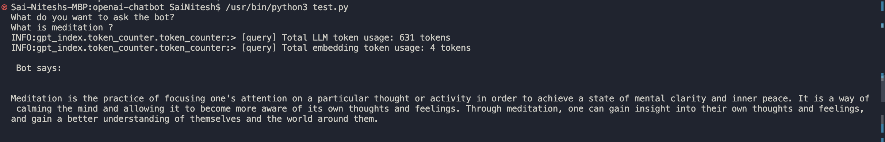
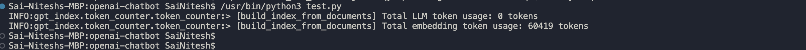

# Introduction

Currently this repo has the openai usage of training with the own data and generating the responses like chat interface

Set the OPEN_API_KEY env variable using the api key from the openai account

## Sample Screenshots

### Training 

### Chat Response
