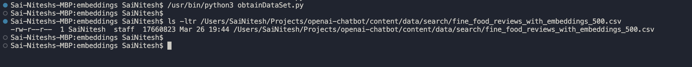

# Introduction

Currently this repo has the openai usage of training with the own data and generating the responses like chat interface

Set the OPEN_API_KEY env variable using the api key from the openai account

## Sample Screenshots

### Training 

### Chat Response

## Create Embedding
This will combine the review summary and review text into a single combined text. The model will encode this combined text and output a single vector embedding

## Semantic Text Search Using Embeddings
This will search through all our reviews semantically in a very efficient manner and at very low cost, by simply embedding our search query, and then finding the most similar reviews.

